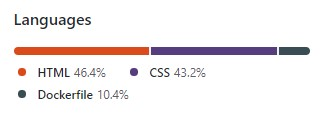
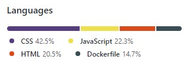
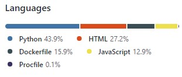
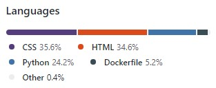
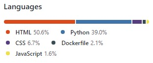

### Hello! 🙋🏻‍♂️

I'm Ricardo.

I am a Certified Project Manager with 10 years of experience in Project Management. Seeking a career change, I have been learning and developing my skills as a Full Stack Software Developer for the past year.
I have just finished my Diploma with Code Institute where I gained the amazing experience of building 5 Portfolio Projects. The links to these projects are listed below. I am now focusing on learning and developing my skills further with React. I can't wait to show you my results soon.

5 Portfolio Projects

### Project 1 - https://ricardoit-web.github.io/motorbikebuddy.com/  

### Project 2 - https://ricardoit-web.github.io/rock-scissors-paper/

### Project 3 - https://love-running-members-log.herokuapp.com/

### Project 4 - https://diners-3star-restaurant.herokuapp.com/

### Project 5 - https://c-soars.herokuapp.com/

### My first React app - https://ricardoit-web.github.io/tic-tac-toe/

<!--
**RicardoIT-Web/RicardoIT-Web** is a ✨ _special_ ✨ repository because its `README.md` (this file) appears on your GitHub profile.

Here are some ideas to get you started:

- 🔭 I’m currently working on ...
- 🌱 I’m currently learning ...
- 👯 I’m looking to collaborate on ...
- 🤔 I’m looking for help with ...
- 💬 Ask me about ...
- 📫 How to reach me: ...
- 😄 Pronouns: ...
- ⚡ Fun fact: ...
-->
